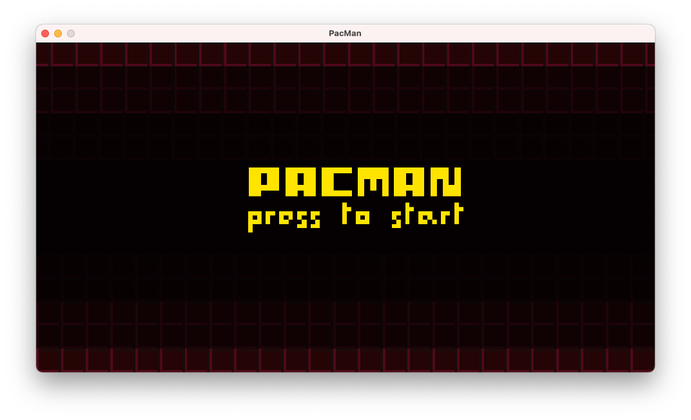
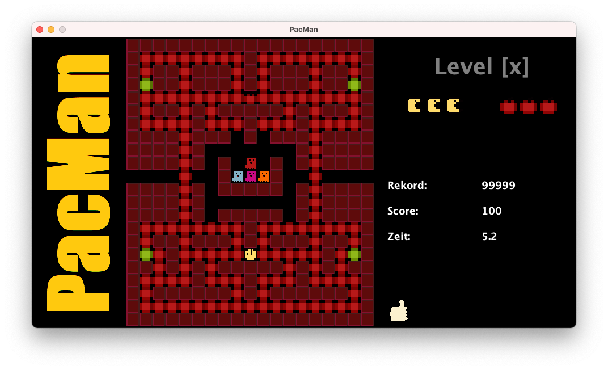
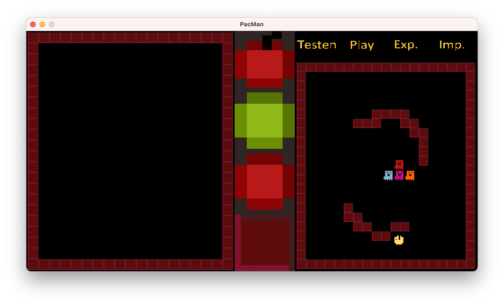

# Pacman-Clone

## Disclaimer
The game is not finished yet so a few things are not complete. I don't recommend installing it, if you just want to play a bit.

## Steering

<table>
    <tr>
        <td><b>Key</b></td><td><b>Action</b></td>
    </tr>
    <tr>
        <td>Arrows</td><td>Movement</td>
    </tr>
    <tr>
        <td>B-Key</td><td>Builing-Mode</td>
    </tr>
    <tr>
        <td>P-Key</td><td>Default- / Gaming-Mode</td>
    </tr>
</table>

## Building Mode

To get into builing mode press b on the main screen and go on. 

<table>
    <tr>
        <td>Testen</td><td>load currently modified map into the test field</td>
    </tr>
    <tr>
        <td>Play</td><td>run the loaded map</td>
    </tr>
    <tr>
        <td>Exportieren</td><td>export the map into your file system</td>
    </tr>
    <tr>
        <td>Importieren</td><td>import a map from a file on the file system</td>
    </tr>
</table>

To draw a map just choose your item in the middle of the screen and start your drawing. Do delete a block use your right click. Please mind that the spawning area must stay the same.

# License
 
    This 
    work
    by 
    Yves-Simon Zeulner 
    is licensed under a 
    <a rel="license" href="http://creativecommons.org/licenses/by-nc-sa/4.0/" target='_blank'>Creative Commons Attribution-NonCommercial-ShareAlike 4.0 International License</a>.

#### You are allowed to:
<table>
  <tr>
    <td>Share</td>
    <td>copy and redistribute the material in any medium or format</td>
  </tr>
  <tr>
    <td>Adapt</td>
    <td>remix, transform, and build upon the material</td>
  </tr>
</table>

#### But under the following terms:
<table>
  <tr>
    <td>Attribution</td>
    <td>You must give appropriate credit, provide a link to the license, and indicate if changes were made. You may do so in any reasonable manner, but not in any way that suggests the licensor endorses you or your use.</td>
  </tr>
  <tr>
    <td>NonCommercial</td>
    <td>You may not use the material for commercial purposes.</td>
  </tr>
  <tr>
    <td>ShareAlike</td>
    <td>If you remix, transform, or build upon the material, you must distribute your contributions under the same license as the original.</td>
  </tr>
</table>
